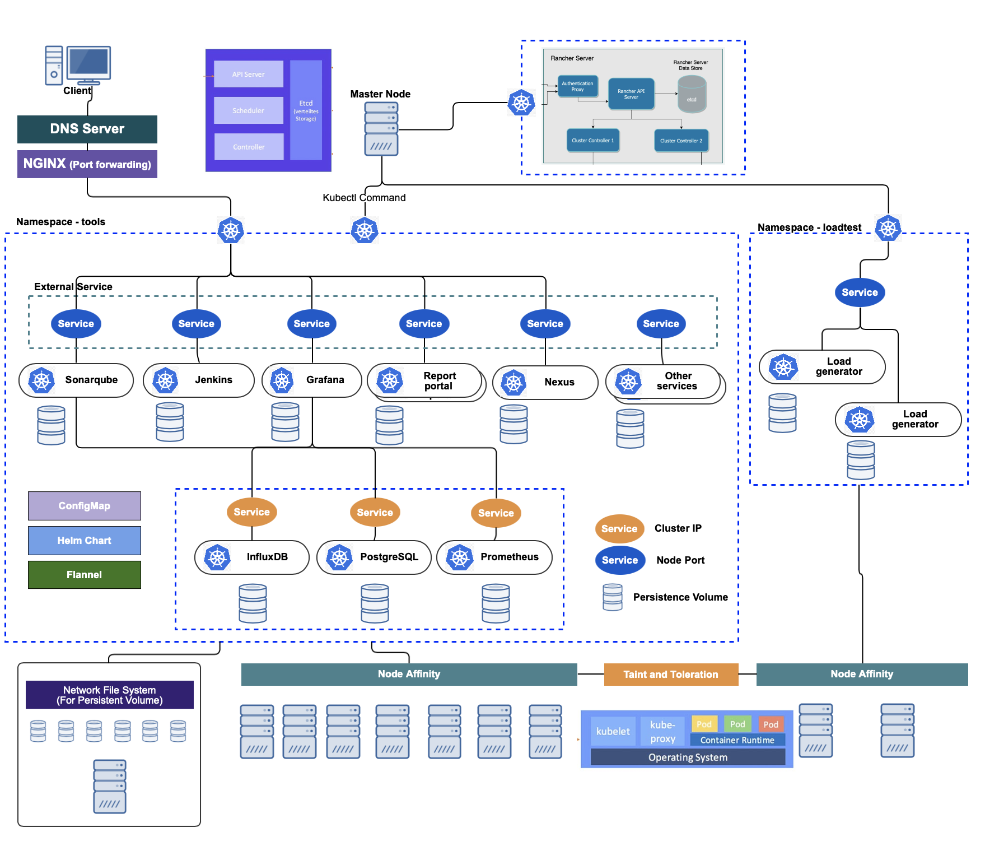

# k8s-charts

In this repository, I'm going to remain various information to set up the Kubernetes environment which can manage services for you or your team. 

## What I'm going to do..

I've been forcusing on the Software Quality Engineering for a long time and needed various tools to make the Quality environment for the team. But if we set up those service each VM there is many efforts to maintain the environment and these are really time-cosuming works for the team. So, I've tried to migrate these services into the cluster that offer wondeful maintaining fuctions to us. 

I will try to add helm charts and setting ways for the service and write down the document. 
Remember! It would not be exactly same as above architecture diagram because it needs many resource to run simultaneously. Don't worry, you can refer ways to install the local Kubernetes environment with a lightweigh tool named `kind` and `k3d`.

## Documents
|                  Document                      |
|------------------------------------------------|
| [Create the cluster with kind](k8s/kind/README.md) |
| [Install ingress-controller](k8s/ingress-controller/README.md) |
| [Install Metallb](k8s/metallb/README.md) |

## Authors
- Allen Kim - Initial work - [coolexplorer](https://github.com/coolexplorer)

## License

This project is licensed under the MIT License - see the [LICENSE.md](LICENSE.md) file for details